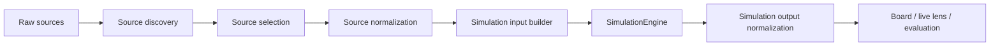

# Unified Simulation Adapter Design

## Goal
Create one adapter contract for all sports so the simulation engine receives a consistent, auditable, and testable input payload regardless of whether the sport is daily, weekly, live-state driven, or artifact-driven.

## Implementation Status
The initial shared implementation lives in [syndicate/features/shared/simulation_adapter.py](../../syndicate/features/shared/simulation_adapter.py).

The default runtime entrypoint for sport boards now attaches the contract through [syndicate/features/shared/game_board_contract.py](../../syndicate/features/shared/game_board_contract.py).

The intelligence scoring path now uses the same shared module to build its simulation engine input payload.

The adapter should normalize sources before simulation runs. It should not mix normalization, fallback selection, rendering decoration, and evaluation bookkeeping in the same step.

## Design Principles

* One sport adapter, one normalized contract.
* Source selection must be explicit and recorded.
* Simulation inputs must be separate from UI decoration.
* Live-state should enrich a slate only when it is the best available source, not as a side effect of rendering.
* Evaluation history should feed back into adapter scoring, not only into reporting.
* The adapter should be able to explain why a slate was built the way it was.

## Proposed Contract

Every sport adapter should emit the same top-level shape before the engine runs:

```json
{
  "sport": "nba",
  "date": "2026-06-22",
  "source_mode": "live_supplement",
  "freshness": {
    "requested_date": "2026-06-22",
    "resolved_date": "2026-06-22",
    "is_current_day": true,
    "is_stale": false
  },
  "source_paths": {
    "primary": "...",
    "fallback": ["..."]
  },
  "games": [
    {
      "game_id": "...",
      "event_id": "...",
      "away": {"abbr": "..."},
      "home": {"abbr": "..."},
      "state": {
        "status": "Scheduled",
        "live": false,
        "final": false
      },
      "inputs": {
        "team": {},
        "player": [],
        "market": {},
        "live": {},
        "evaluation": {}
      },
      "simulation": {},
      "display": {}
    }
  ]
}
```

## Adapter Pipeline



### 1. Source discovery
Find all candidate inputs available for the requested sport and date.

Examples:

* processed artifacts
* live scoreboard rows
* live player boxscore rows
* player lens rows
* props and lines snapshots
* season or weekly recommendation summaries
* evaluation and calibration history

### 2. Source selection
Choose the best available source mode for the requested slate.

The selection should be explicit and recorded as one of:

* `artifact_only`
* `live_supplement`
* `live_fallback`
* `remote_source`
* `snapshot_only`
* `archive_fallback`

### 3. Source normalization
Convert sport-specific rows into a common game record.

The normalized record should carry:

* game identity
* matchup identity
* timing and status
* team projections
* player projections
* live state
* market data
* evaluation context

### 4. Simulation input builder
Transform the normalized game record into the engine’s `game_context`.

The builder should decide:

* which team projection fields matter
* which player projections are eligible
* which market signals adjust confidence or edge
* which live features should modify the mean, variance, or win probability

### 5. Simulation engine execution
Call the shared Monte Carlo engine with the normalized context.

The adapter should not embed sport-specific simulation math directly unless that math is truly sport-specific and not just source normalization.

### 6. Output normalization
Convert the engine result back into the sport’s board contract.

The board payload should preserve:

* source mode
* source paths
* freshness
* simulation summary
* evaluation hooks

It should not lose the distinction between inputs and presentation fields.

## Sport-Specific Source Strategy

### MLB
Primary source should be the daily summary artifact lane. Live-lens should supplement missing or stale rows, and evaluation signals should be used to calibrate confidence and segment-level modifiers.

### NBA
Primary source should be the processed card lane, with live state, player lens, and live lines used to supplement or replace stale rows on current-day slates.

### WNBA
Primary source should follow the NBA-style contract, but with stricter current-day precedence because processed rows are more likely to lag the public scoreboard.

### NHL
Primary source should be processed predictions, with scoreboard snapshots and props/reconciliation data used to enrich or recover missing game context.

### NFL
Primary source should be the weekly snapshot lane, with injury, odds, and calibration data used to adjust weekly context.

### NCAAB
Primary source should be the mirrored recommendation lane, with market shape and pace/context signals added where available.

### NCAAF
Primary source should be the stored weekly summary lane, with weather, injury, and market signals added where available.

## Consistency Rules

1. The adapter must always record which source mode won.
2. Current-day live data cannot silently override the slate without being marked.
3. If a sport has both live and stored sources, the adapter should choose explicitly based on freshness and completeness.
4. Simulation inputs must be stable enough to replay.
5. Presentation-only fallback must never change the simulation meaning.
6. Evaluation feedback should update adapter confidence rules, not just report post-hoc results.

## Implementation Phases

### Phase 1: Shared contract
Create a common schema for normalized game input and simulation output.

### Phase 2: Adapter wrappers
Wrap existing sport builders so they emit the shared shape without changing UI routes.

### Phase 3: Live-state unification
Make current-day live selection and stale artifact suppression consistent across all sports that have live feeds.

### Phase 4: Evaluation feedback loop
Feed calibration, accuracy, and drift signals back into the adapter scoring rules.

### Phase 5: Board cleanup
Remove sport-specific duplication in the board layer once the adapter contract is stable.

## Recommended First Targets

1. NBA and WNBA, because they already have live-state payloads and sim-detail routes.
2. MLB, because it has the richest artifact structure and the biggest opportunity to normalize existing simulation-adjacent outputs.
3. NHL, because it has enough stored and live data to benefit from a cleaner source selection contract.

## Open Gaps

* The common schema does not yet exist as a shared module.
* Evaluation feedback is not yet a first-class adapter input.
* Some sports still mix display concerns into the payload builder.
* Current-day precedence rules are still different across sports.

## Bottom Line
The unified adapter should become the layer that answers: what is the best source for this sport and date, what inputs are truly ready for simulation, and what should be carried forward as display-only enrichment.