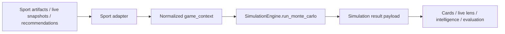

# Simulation Engine Map

## What The Simulation Engine Is Today
Syndicate currently uses one generic Monte Carlo engine in [syndicate/features/simulation_engine.py](../../syndicate/features/simulation_engine.py). It is sport-agnostic and accepts a normalized `game_context` payload with:

* team projections
* player projections
* matchup modifiers
* win probability / confidence / edge inputs
* optional seed and push threshold

The engine returns a probability distribution, team-score expectations, player stat distributions, variance, and standard deviation summaries. It does not know the sport by itself; sport-specific behavior is created by the calling adapters.

## Architecture Shape

## Per-Sport Map

### MLB
MLB is the most developed sport-specific board pipeline. The cards builder in [syndicate/features/mlb/cards.py](../../syndicate/features/mlb/cards.py) assembles game cards from daily summary artifacts, live-lens reports, betting-game recommendation rows, daily sim rows, and actual result rows.

Advanced MLB inputs available in the daily-update path include:

* daily summary outputs and per-game sim rows
* live-lens rows and `gameLens` detail
* lineup health and snapshot lineups
* HR target shelves and first-inning signal rows
* market availability for game lines, pitcher props, and hitter props
* official and playable recommendation rows
* actual result rows and boxscore-derived segment context
* prop rows, tracked game lines, and live prop rows
* workflow / source metadata used to explain how the slate was produced

Current shape:

* cards are built from stored daily summary artifacts first
* live-lens data is used as a fallback when summary artifacts are empty
* each card carries prediction rows, market rows, first-inning / segment rows, and live-lens-aligned game context
* the board is not yet a direct `SimulationEngine` caller; it is an artifact aggregator with simulation-like outputs already embedded in the daily summary payloads

The shared simulation adapter now preserves these MLB fields inside the normalized contract so the engine can consume them explicitly instead of relying on render-only board decoration.

What this means:

* MLB has the richest artifact layer and the clearest simulation-adjacent board contract
* MLB already exposes projection rows and segment overview cards, but not a single canonical simulation adapter interface shared by the other sports

### NBA
NBA uses a more live-aware cards stack in [syndicate/features/nba/cards.py](../../syndicate/features/nba/cards.py).

Current shape:

* `build_cards_page_context()` reads processed cards and supplements them with live state
* `build_cards_sim_detail_payload()` exposes per-game simulation detail for a matchup
* `build_live_state_payload()` provides current-day live scoreboard and live player context
* the home page and live lens can both consume the same live-state lane, but with different fallback rules

What this means:

* NBA is closer to a unified board-plus-live contract than most other sports
* the sport still depends on several parallel artifact types instead of one shared simulation manifest

### WNBA
WNBA now mirrors the NBA-style contract, but with more current-day fallback complexity.

Current shape:

* `build_cards_page_context()` serves the board from processed cards, then supplements with live scoreboard rows
* `build_source_cards_payload()` serves the source-cards endpoint used by `/wnba`
* `build_source_cards_sim_detail_payload()` exposes per-game simulation detail
* `build_live_state_payload()` is the live scoreboard and live-state adapter used by home, cards, props, and live-lens routes

What this means:

* WNBA has the same broad contract as NBA, but it also needs to reconcile stale processed artifacts against today's ESPN scoreboard
* the main current risk is inconsistent fallback behavior between home, source cards, and live-lens routes

### NHL
NHL is currently artifact-first and less simulation-driven in the board layer.

Current shape:

* `build_cards_page_context()` uses processed predictions as the primary board source
* if predictions are empty, it falls back to archived scoreboard rows
* the board exposes predictions, recommendations, and props sections, but not a full Monte Carlo simulation interface

What this means:

* NHL has a usable board contract, but it is not normalized around the shared simulation engine
* the sport behaves more like a stored recommendation pipeline than a live simulation pipeline

### NFL
NFL is weekly and snapshot-driven rather than daily live-slate driven.

Current shape:

* `build_cards_page_context()` reads stored weekly recommendation snapshots
* cards are grouped by matchup and season/week rather than by date + live scoreboard state
* there is no direct live-state simulation path in the current cards layer

What this means:

* NFL has a stable stored snapshot contract
* it does not yet share the same simulation payload shape as MLB/NBA/WNBA

### NCAAB
NCAAB is mirrored-recommendation driven.

Current shape:

* `build_cards_page_context()` renders mirrored recommendation payloads
* the board is grouped from stored recommendation rows
* there is no current simulation adapter that feeds the cards board from a general Monte Carlo engine

What this means:

* NCAAB is consistent as a mirrored recommendation board
* it is not yet simulation-normalized across the shared engine contract

### NCAAF
NCAAF is also snapshot-driven and intentionally lightweight.

Current shape:

* `build_cards_page_context()` reads stored weekly summary artifacts
* the board summarizes recommendation rows and stored signal types
* there is no direct simulation engine adapter in the current route contract

What this means:

* NCAAF is stable as a stored summary board
* it is not yet participating in a unified simulation layer

## Current Gaps

### 1. No shared simulation contract across sports
The engine is generic, but the payloads are not. Each sport names inputs and outputs differently:

* MLB uses daily summaries, live-lens reports, and segment outputs
* NBA/WNBA use processed cards, live state, and sim-detail payloads
* NHL uses predictions and recommendations
* NFL uses weekly snapshot rows
* NCAAB/NCAAF use mirrored or stored recommendation summaries

### 2. Live-fallback rules are inconsistent
Some sports prefer live state when today is requested, some prefer stored snapshots, and some fall back to archived data only. That makes current-day behavior hard to reason about and hard to test.

### 3. Simulation math and card assembly are not separated everywhere
In several sports, the board payload already mixes source rows, projections, recommendations, and live-state data. That makes it difficult to tell which inputs actually drive the simulation result versus which inputs only decorate the board.

### 4. Output schema is not normalized
The same concepts appear under different field names:

* `sim`
* `live_state`
* `prediction_rows`
* `recommendations`
* `outputs`
* `summary`
* `probability_distributions`

### 5. Evaluation is decoupled, but not yet uniform
The evaluation layer exists, but each sport feeds it through slightly different payload shapes and freshness rules. That makes cross-sport comparison harder than it should be.

## Where Available Data Is Underused

This is the practical answer to the question: where do we already have data, but are not yet using it to improve simulation quality?

### MLB
MLB has the deepest artifact stack, but the simulation adapter still does not consume all of it in one normalized pass.

Underused inputs:

* live-lens state and live boxscore context alongside the daily summary rows
* segment-level outputs and first-inning / partial-inning context
* actual-result rows as a calibration input for future runs
* recommendation metadata as structured simulation modifiers instead of only display context

Impact:

* the board can show rich context, but the simulation layer still behaves like a downstream consumer of prebuilt daily outputs instead of a single cross-checked model input stack

### NBA
NBA has live state, player lens, props, lines, and sim detail, but these signals are not always collapsed into one consistent simulation payload.

Underused inputs:

* current live scoreboard status and score drift
* live player boxscore and player lens data
* live lines / odds movement and prop context
* historical evaluation signals for confidence shaping

Impact:

* the sport can react to current game state, but the simulation input shape is still fragmented across board, live-lens, and props modules

### WNBA
WNBA has the same live-state opportunities as NBA, plus a lot of current-day fallback complexity.

Underused inputs:

* live scoreboard data when processed artifacts are stale or incomplete
* live player boxscore, live player lens, live lines, and play-by-play state
* stored sim detail and props artifacts as shared model features
* evaluation history to decide when today should trust live rows over artifact rows

Impact:

* current-day data is available, but the route stack has historically split it across home, source cards, and live-lens paths instead of feeding one unified slate decision

### NHL
NHL has scoreboard snapshots, props, and reconciliation-style data, but the board is still mostly treating predictions as the primary artifact.

Underused inputs:

* scoreboard snapshots as a live state check rather than only a fallback
* props and reconciliation context as model features
* historical accuracy signals to influence which predictions deserve stronger weight

Impact:

* the sport can display prediction context, but the simulation layer is not yet using the broader live and reconciliation context as a first-class input set

### NFL
NFL is already weekly and snapshot-driven, but that also means it underuses a lot of potentially useful season context.

Underused inputs:

* injury and roster-status context when available
* odds movement and market-shape context
* historical evaluation and calibration signals by market type
* matchup-specific context that could refine weekly projections

Impact:

* the weekly snapshot is stable, but it is not yet a fully adaptive simulation input stack

### NCAAB
NCAAB uses mirrored recommendation payloads, but the simulation-side value is still mostly flattened into board rows.

Underused inputs:

* line movement and market shape
* game tempo / pace context where available
* evaluation history for conference or matchup patterns
* source metadata that could explain volatility or reliability

Impact:

* the board is consistent, but the simulation layer is still mostly a consumer of collapsed recommendation data rather than a richer market-aware model

### NCAAF
NCAAF is similarly snapshot-driven and could use more of its surrounding state.

Underused inputs:

* injury and lineup context
* weather / environment / venue context where available
* market shape and line movement
* evaluation feedback to distinguish stable from volatile weekly spots

Impact:

* the weekly summary is reliable as a stored artifact, but not yet a high-context simulation feed

## Highest-Value Fixes

If we want to use available data more effectively, the first changes should be:

1. Build one normalized simulation input contract for all sports.
2. Make live-state vs artifact precedence explicit for current-day slates.
3. Separate model inputs from display enrichment so UI fallback does not change simulation meaning.
4. Feed evaluation and calibration back into the adapter layer instead of only the reporting layer.
5. Add parity tests that prove each sport uses the richest available source for the requested slate.

## Coverage Verdict

This is the practical answer to whether the daily pipeline is already generating everything needed for simulation inputs.

| Sport | Verdict | What the pipeline already covers | Main gap |
| --- | --- | --- | --- |
| MLB | Partial | Daily summaries, live-lens rows, lineups, HR targets, first-inning signals, actual results, market availability, props, and stateful segment data are now normalized into the shared contract. | The richest inputs still live across multiple MLB artifact lanes, so the board and sim-adjacent surfaces are not yet one single source of truth. |
| NBA | Partial | Processed cards, live state, player lens, sim detail, lines, props, and evaluation context are all present. | Inputs are still fragmented across several modules instead of collapsing into one unified simulation payload. |
| WNBA | Partial | Processed cards, live state, player boxscore, player lens, lines, play-by-play, sim detail, and props are available. | Current-day fallback and stale-artifact precedence still need to be made fully uniform. |
| NHL | Partial | Predictions, props, scoreboard snapshots, and reconciliation-style data are present. | It still behaves more like a stored recommendation board than a fully normalized simulation input stack. |
| NFL | Partial | Weekly snapshots, recommendation rows, and season-scoped board data are present. | The weekly path is stable, but it does not yet expose a full live-style simulation contract. |
| NCAAB | Partial | Mirrored recommendation payloads, season/date card data, and board-ready outputs are present. | The recommendation rows are still mostly flattened into display payloads rather than simulation-ready inputs. |
| NCAAF | Partial | Weekly summary artifacts and grouped recommendation rows are present. | The weekly summary is reliable, but it is not yet a high-context simulation feed. |

Bottom line: the daily pipeline is generating a usable normalized simulation reference for every sport, but not a fully complete and uniform simulation-input set across all sports yet.

## Consistency Plan

### 1. Define one normalized sport simulation contract
Every sport should produce the same top-level structure:

* `date`
* `sport`
* `games`
* `source_paths`
* `freshness`
* `fallback_mode`
* `simulation`
* `evaluation`

### 2. Introduce a per-sport adapter layer
Each sport should translate its raw source artifacts into the shared contract before any rendering or intelligence layer consumes it.

### 3. Make current-day fallback explicit
The route should always tell us whether it used:

* stored artifact rows
* live scoreboard supplement
* archived snapshot fallback
* source-app remote fallback

### 4. Keep simulation inputs separate from display enrichment
Projection math, scoreboard enrichment, odds enrichment, and UI decoration should be distinct stages so the simulation source of truth stays auditable.

### 5. Add sport-parity tests
The same tests should exist for each sport:

* current-day data is available
* stale artifact rows are absent or downgraded correctly
* live supplement does not duplicate games
* no-op days still render cleanly
* fallback mode is explicit in the payload

## Recommended Next Step
Turn this map into a small shared contract module and then port each sport one by one into the same shape, starting with NBA and WNBA because they already have the closest live-state model.

## Adapter Design Reference
See [simulation_adapter_design.md](simulation_adapter_design.md) for the proposed unified adapter contract, per-sport source strategy, and rollout plan.

## Shared Adapter Module
The first shared adapter implementation lives in [syndicate/features/shared/simulation_adapter.py](../../syndicate/features/shared/simulation_adapter.py).