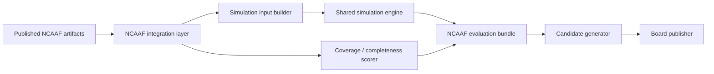

# NCAAF Phase 2.1 Smart Simulation Integration Design

## Purpose

This document defines the next integration phase for NCAAF after onboarding, board publication framework work, Week 1 readiness assessment, and the smart-simulation integration audit.

It does not change football models.

Its goal is to connect the already published NCAAF onboarding artifacts into the runtime forecasting, simulation, evaluation, candidate-generation, and board-publication pipeline.

## Current State

Published artifacts exist and validate successfully:

- [ncaaf_team_registry.csv](data/ncaaf_source/source_artifacts/data/processed/team_registry/ncaaf_team_registry.csv)
- [ncaaf_player_identity_snapshot.csv](data/ncaaf_source/source_artifacts/data/processed/player_identity/ncaaf_player_identity_snapshot.csv)
- [ncaaf_roster_snapshot.csv](data/ncaaf_source/source_artifacts/data/processed/roster/ncaaf_roster_snapshot.csv)
- [ncaaf_transfer_portal_snapshot.csv](data/ncaaf_source/source_artifacts/data/processed/transfers/ncaaf_transfer_portal_snapshot.csv)
- [ncaaf_returning_production_snapshot.csv](data/ncaaf_source/source_artifacts/data/processed/returning_production/ncaaf_returning_production_snapshot.csv)
- [ncaaf_coach_continuity_snapshot.csv](data/ncaaf_source/source_artifacts/data/processed/coach_continuity/ncaaf_coach_continuity_snapshot.csv)

The audit showed:

- NCAAF smart simulations exist only at the platform level.
- NCAAF board routes are still summary-artifact-backed.
- The onboarding artifacts are used by builders and validators, but not by the runtime forecasting/simulation/evaluation/board pipeline.

## Design Goal

Introduce a NCAAF artifact-driven runtime layer that can:

- build simulation input from published NCAAF artifacts
- score candidate quality using feature completeness
- route candidates through evaluation and simulation
- publish board rows with confidence controls based on feature coverage

The design must preserve the current football model layer and operate above it.

## Non-Goals

- No football model rewrites.
- No changes to historical score or projection formulas.
- No replacement of the existing NCAAF summary-backed board as a first step.
- No dependency on live source feeds for the initial integration slice.

## Target Architecture

The intended flow is:

1. Published NCAAF artifacts are loaded through a dedicated integration layer.
2. The integration layer normalizes team and feature availability for each game candidate.
3. A NCAAF simulation input builder converts the artifact state into runtime simulation context.
4. The shared simulation engine produces forecast outputs.
5. A NCAAF evaluation bundle scores confidence, completeness, and publication eligibility.
6. The board publisher consumes the evaluated candidates and renders publishable, warning, or suppressed rows.

## Required Runtime Layers

### 1. Artifact Access Layer

This layer is responsible for reading the published artifacts in a stable way.

Responsibilities:

- load team registry rows
- load player identity rows
- load roster rows
- load transfer portal rows
- load returning production rows
- load coach continuity rows
- expose a single normalized artifact context for each team and game

Recommended implementation shape:

- a NCAAF artifact repository module or service
- cache-backed artifact access keyed by season and week
- strict validation against the published artifact schema

### 2. Team Resolution Layer

This layer resolves game participants through the team registry and canonical aliases.

Responsibilities:

- map source names to canonical team ids
- detect normalization failures separately from missing feature coverage
- produce a per-team resolution result

Required output fields:

- canonical team id
- canonical team name
- alias used
- registry match status
- resolution confidence

### 3. Feature Coverage Layer

This layer determines whether each artifact is present for each team in a matched game.

Responsibilities:

- check player identity coverage
- check roster coverage
- check transfer coverage
- check returning production coverage
- check coach continuity coverage
- compute feature completeness score
- assign coverage tier

This layer should remain independent from simulation math.

### 4. Simulation Input Builder

This is the key missing bridge.

Responsibilities:

- convert artifact state into the simulation contract expected by the shared engine
- attach team-level feature context to candidate games
- surface feature completeness metadata into simulation context
- preserve the existing football adapter shape

The builder should not mutate underlying models. It should only prepare richer context.

### 5. Evaluation Bundle

This layer translates simulated outputs into board-facing quality signals.

Responsibilities:

- compute confidence adjustments
- encode feature-coverage warnings
- decide publish vs warn vs suppress
- propagate reason codes into the board payload

This bundle should align with the board publication framework.

### 6. Candidate Generator

This layer should produce NCAAF board candidates from the artifact-aware runtime context.

Responsibilities:

- generate board candidate rows for matched games
- filter out registry failures
- keep suppressed rows available for audit/backfill views
- preserve a reasoned trail from artifact gaps to candidate status

### 7. Board Publisher

This layer publishes the final board contract.

Responsibilities:

- publish Tier A rows normally
- publish Tier B rows with warnings and reduced confidence
- suppress Tier C and Tier D rows
- keep suppressed rows available for internal analysis, not public display

## Proposed Contracts

### NCAAF Artifact Context

Each game should resolve into a structured context containing:

- season
- week
- home team resolution
- away team resolution
- feature coverage flags
- feature completeness score
- coverage tier
- missing layer list

### NCAAF Simulation Context

The simulation context should include:

- game metadata
- market metadata
- normalized team metadata
- feature completeness metadata
- artifact provenance

### NCAAF Evaluation Output

The evaluation output should include:

- publication status
- confidence score
- warning list
- suppression reason
- recoverability flag

## Coverage Tier Mapping

Use the board publication framework tiers as the runtime language for this phase.

- Tier A: full feature coverage
- Tier B: missing one secondary feature layer
- Tier C: missing multiple feature layers
- Tier D: market-only coverage

For Phase 2.1, the runtime should consume this tiering directly instead of inventing a second classification system.

## Confidence Model

Confidence should be a presentation and eligibility control, not a model rewrite.

Recommended behavior:

- start from a base confidence for matched candidates
- subtract penalties for missing layers
- apply a larger penalty for Tier C and Tier D
- preserve explicit reason codes for the board UI

The confidence score should explain why a game is warning-only or suppressed.

## Integration Strategy

### Stage 1 - Read-Only Artifact Wiring

Build the NCAAF artifact context layer and connect it to candidate inspection only.

Expected result:

- every matched game has a tier, missing-layer list, and confidence explanation
- no board behavior changes yet

### Stage 2 - Simulation Context Bridging

Attach the artifact context to the shared simulation adapter path.

Expected result:

- NCAAF candidates reach the shared simulation engine with artifact-enriched metadata
- artifact coverage can influence evaluation and confidence

### Stage 3 - Candidate Publication Gating

Use tier and completeness scoring to decide publish / warn / suppress.

Expected result:

- Tier A publishes normally
- Tier B publishes with warnings
- Tier C and Tier D are suppressed

### Stage 4 - Board Contract Alignment

Expose the new runtime status in the board payload while keeping the current summary-backed board intact until the new path is stable.

Expected result:

- public board sees deterministic status labels and confidence
- internal audit views can still trace all suppressed rows

## Required Modules

The design implies new NCAAF integration modules, not football model rewrites.

Likely module responsibilities:

- NCAAF artifact context loader
- NCAAF team resolution service
- NCAAF coverage scorer
- NCAAF simulation input adapter
- NCAAF evaluation bundle builder
- NCAAF publication gate

## Validation Requirements

This phase should be considered complete only when the following are true:

1. Published artifacts are loaded through the new integration layer.
2. Matched Week 1 games produce consistent tier and confidence output.
3. Tier A games are publishable without warning.
4. Tier C and Tier D games are suppressed with explicit reasons.
5. The shared simulation engine receives NCAAF candidates through the new adapter path.
6. The board publisher receives evaluated NCAAF candidates instead of only summary rows.

## Relationship To Existing Work

This design builds on:

- [ncaaf_board_publication_framework.md](ncaaf_board_publication_framework.md)
- [ncaaf_week1_publication_readiness_report.md](ncaaf_week1_publication_readiness_report.md)
- [ncaaf_smart_sim_integration_audit.md](ncaaf_smart_sim_integration_audit.md)

Those documents establish the current state and publication rules.

This Phase 2.1 design defines the runtime integration path that is still missing.

## Practical Outcome

If implemented, Phase 2.1 would convert NCAAF from:

- artifact publication only

to:

- artifact publication + artifact-aware forecasting + simulation-aware board generation

## Final Recommendation

Proceed with a dedicated NCAAF integration layer that reads the published onboarding artifacts, computes feature coverage and confidence, and feeds the shared simulation and board pipeline.

Do not modify football models as part of this phase.