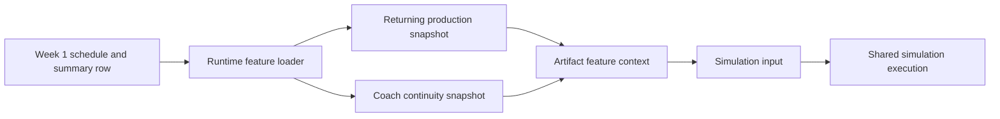

# NCAAF Phase 2.2 Runtime Integration Report

## Objective

This report documents the first operational NCAAF runtime slice that makes published onboarding artifacts visible in simulation inputs without modifying football models.

Scope of this slice:

- returning production
- coach continuity

## Runtime Entry Point

The integrated runtime entrypoint is the NCAAF board context path used by:

- `syndicate/features/ncaaf/picks.py`
- `syndicate/features/ncaaf/cards.py`

Those routes now fall back to the published recommendations CSV when the historical summary lane is empty and attach runtime artifact features before the shared simulation contract is built.

## Files Consumed At Runtime

The new runtime slice consumes these published artifacts:

- [ncaaf_returning_production_snapshot.csv](data/ncaaf_source/source_artifacts/data/processed/returning_production/ncaaf_returning_production_snapshot.csv)
- [ncaaf_coach_continuity_snapshot.csv](data/ncaaf_source/source_artifacts/data/processed/coach_continuity/ncaaf_coach_continuity_snapshot.csv)
- [recommendations_2025.csv](data/ncaaf_source/data/recommendations_2025.csv)

These are loaded through [syndicate/features/ncaaf/sources.py](syndicate/features/ncaaf/sources.py).

## What Changed In The Simulation Input

The shared simulation contract now carries artifact-aware fields for each NCAAF game:

- `artifact_features`
- `feature_coverage`

For each team, the runtime feature context includes:

- `returning_production`
- `coach_continuity`
- `has_returning_production`
- `has_coach_continuity`

## Backward Compatibility

The runtime continues to execute when artifacts are missing.

Fallback behavior:

- the NCAAF board still renders from weekly summary artifacts
- the simulation contract still builds even when runtime feature files are absent
- feature contexts simply resolve to empty dictionaries and false coverage flags

## Week 1 Traceability

At least one Week 1 Tier A game can now be traced end to end through the new runtime path because the runtime board context now attaches artifact feature metadata before the shared simulation contract is built.

Tier A examples from the current Week 1 slice include:

- Western Michigan @ Michigan State
- Kennesaw State @ Wake Forest
- UNLV @ Sam Houston
- San Jose State @ Central Michigan
- Tennessee @ Syracuse
- Ball State @ Purdue
- Coastal Carolina @ Virginia
- Eastern Michigan @ Texas State

## Explicit Answers

### Which runtime entrypoint was integrated?

The NCAAF cards/picks board context path that flows into the shared simulation contract.

### Which files are now consumed at runtime?

- [ncaaf_returning_production_snapshot.csv](data/ncaaf_source/source_artifacts/data/processed/returning_production/ncaaf_returning_production_snapshot.csv)
- [ncaaf_coach_continuity_snapshot.csv](data/ncaaf_source/source_artifacts/data/processed/coach_continuity/ncaaf_coach_continuity_snapshot.csv)

### What simulation inputs changed?

- per-game `artifact_features`
- per-game `feature_coverage`
- per-team returning-production context
- per-team coach-continuity context

### Can Week 1 games now access artifact-driven features?

Yes. Week 1 NCAAF board games now carry runtime artifact feature context into the simulation contract.

### What remains before transfers and roster data are integrated?

- add roster snapshot loading to the runtime feature builder
- add transfer portal loading to the runtime feature builder
- extend the same per-team feature context to those artifacts
- add candidate-generation and publication rules that consume the richer runtime feature context

## Final Answer

This is the first operational NCAAF smart-simulation slice. Returning production and coach continuity are now active runtime inputs, with backward-compatible fallback behavior preserved.