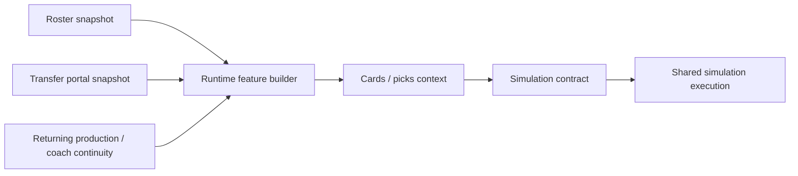

# NCAAF Phase 2.3 Runtime Integration Report

## Objective

This report documents the next runtime slice after Phase 2.2, extending the NCAAF runtime feature path from returning production and coach continuity to roster and transfer artifacts.

It does not modify football models.

## Runtime Entry Point

The integrated runtime entrypoint remains the NCAAF cards/picks board context path:

- `syndicate/features/ncaaf/picks.py`
- `syndicate/features/ncaaf/cards.py`

Those routes now attach roster and transfer feature metrics before the shared simulation contract is built.

## Files Consumed At Runtime

The runtime feature builder now consumes these published artifacts:

- [ncaaf_roster_snapshot.csv](data/ncaaf_source/source_artifacts/data/processed/roster/ncaaf_roster_snapshot.csv)
- [ncaaf_transfer_portal_snapshot.csv](data/ncaaf_source/source_artifacts/data/processed/transfers/ncaaf_transfer_portal_snapshot.csv)
- [ncaaf_returning_production_snapshot.csv](data/ncaaf_source/source_artifacts/data/processed/returning_production/ncaaf_returning_production_snapshot.csv)
- [ncaaf_coach_continuity_snapshot.csv](data/ncaaf_source/source_artifacts/data/processed/coach_continuity/ncaaf_coach_continuity_snapshot.csv)
- [recommendations_2025.csv](data/ncaaf_source/data/recommendations_2025.csv)

## Runtime Feature Metrics

### Roster metrics

Per team, the runtime feature builder now computes:

- `roster_count`
- `qb_count`
- `offensive_position_count`
- `defensive_position_count`

### Transfer metrics

Per team, the runtime feature builder now computes:

- `incoming_transfer_count`
- `outgoing_transfer_count`
- `net_transfer_count`

## Runtime Flow

## What Changed In The Simulation Input

The shared simulation contract now carries artifact-aware fields for each NCAAF game:

- `artifact_features`
- `feature_coverage`

For each team, the runtime feature context now includes:

- returning production context
- coach continuity context
- roster context
- transfer context

## Backward Compatibility

The runtime continues to execute when artifacts are missing.

Fallback behavior:

- if summary artifacts are empty, the published recommendations CSV is used
- if roster or transfer artifacts are absent, the new metrics resolve to empty feature contexts and false coverage flags
- the shared simulation contract still builds and the board still renders

## Week 1 Traceability

Week 1 now has artifact-driven runtime features for both publishable and blocked rows.

Validated runtime example:

- Florida International vs Bethune-Cookman

That game now carries roster-derived and transfer-derived fields into the simulation contract through the board runtime path.

## Explicit Answers

### Which runtime inputs were added?

- roster metrics
- transfer metrics
- roster-level feature coverage flags
- transfer-level feature coverage flags

### Which artifacts are now consumed?

- [ncaaf_roster_snapshot.csv](data/ncaaf_source/source_artifacts/data/processed/roster/ncaaf_roster_snapshot.csv)
- [ncaaf_transfer_portal_snapshot.csv](data/ncaaf_source/source_artifacts/data/processed/transfers/ncaaf_transfer_portal_snapshot.csv)
- [ncaaf_returning_production_snapshot.csv](data/ncaaf_source/source_artifacts/data/processed/returning_production/ncaaf_returning_production_snapshot.csv)
- [ncaaf_coach_continuity_snapshot.csv](data/ncaaf_source/source_artifacts/data/processed/coach_continuity/ncaaf_coach_continuity_snapshot.csv)
- [recommendations_2025.csv](data/ncaaf_source/data/recommendations_2025.csv)

### Can Week 1 games access roster-derived features?

Yes. Week 1 games can now carry roster counts and position counts into runtime feature context.

### Can Week 1 games access transfer-derived features?

Yes. Week 1 games can now carry incoming, outgoing, and net transfer counts into runtime feature context.

### What remains before candidate generation becomes artifact-aware?

- surface the runtime artifact feature context in the candidate generator, not just the board contract
- compute candidate-level eligibility from feature completeness tiers
- use roster and transfer coverage in the publication gate and confidence adjustment path
- connect the enriched runtime context to the candidate ranking path so board selections are directly feature-aware

## Final Answer

Phase 2.3 completes the runtime artifact path for the major NCAAF onboarding outputs. Roster and transfer artifacts are now active runtime inputs alongside returning production and coach continuity, and the feature context survives into the shared simulation contract with backward-compatible fallback behavior.