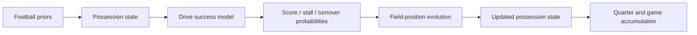

# SmartSim 2.0 Phase 2 Calibration Plan

## Status

Design only. No code is modified in this phase.

Reference inputs:

- [smartsim_2_possession_simulation_architecture.md](smartsim_2_possession_simulation_architecture.md)
- [smartsim_2_phase1_build_plan.md](smartsim_2_phase1_build_plan.md)
- [smartsim_2_phase1_implementation_report.md](smartsim_2_phase1_implementation_report.md)

## Phase 2 Objective

Transform the SmartSim 2.0 kernel from a heuristic possession simulator into a calibrated football simulation engine driven by the existing football feature stack.

Phase 1 proved that a complete game-state loop can run independently of the projection engine.
Phase 2 makes that loop statistically meaningful by wiring real football priors into possession, drive, scoring, turnover, and red-zone evolution.

## Phase 1 Review

The Phase 1 kernel already provides:

- possession state
- drive state
- quarter state
- game loop
- final outcome generation

Current limitation:

- drive outcomes are still heuristic
- projection features do not yet influence possession outcomes

That means Phase 2 should not rebuild the simulator shell.
It should calibrate the shell with football priors and state transitions.

## Current Kernel Review

The Phase 1 kernel currently uses:

- possession owner
- field position
- down
- distance
- quarter
- clock remaining
- offense and defense ratings
- a pace seconds-per-play prior
- heuristic outcome thresholds for touchdown, field goal, punt, turnover, and turnover on downs

This is enough to simulate a game, but not enough to explain why a drive succeeded or failed.

Phase 2 should convert those heuristics into priors derived from the football feature stack.

## Existing Football Inputs That Should Become Simulation Priors

### 1. Pace

Current source surfaces:

- `syndicate/features/football/features/team_metrics.py`
- `syndicate/features/football/features/advanced_metrics.py`
- `syndicate/features/football/features/loaders.py`

Key fields already available:

- `pace_features.pace`
- `pace_features.possessions`
- `home_pace_secs_play`
- `away_pace_secs_play`

Phase 2 use:

- expected plays per drive
- clock consumption per drive
- game pace variance

### 2. Offense

Current source surfaces:

- `syndicate/features/football/features/team_metrics.py`
- `syndicate/features/football/features/advanced_metrics.py`
- `syndicate/features/football/features/loaders.py`

Key fields already available:

- `offensive_epa`
- `epa_play`
- `home_offensive_epa`
- `away_offensive_epa`
- `success_rate`
- `home_success_rate`
- `away_success_rate`
- `pass_rate_over_expectation`
- `proe`
- `home_pass_rate`
- `away_pass_rate`
- `red_zone_efficiency`
- `explosive_play_rate`

Phase 2 use:

- drive success probability
- scoring probability
- explosive-play probability
- red-zone conversion probability

### 3. Defense

Current source surfaces:

- `syndicate/features/football/features/team_metrics.py`
- `syndicate/features/football/features/advanced_metrics.py`
- `syndicate/features/football/features/loaders.py`

Key fields already available:

- `defensive_epa`
- `epa_allowed`
- `home_defensive_epa`
- `away_defensive_epa`
- `success_rate_allowed`
- `home_success_rate_allowed`
- `away_success_rate_allowed`
- `def_pressure_avg`

Phase 2 use:

- turnover pressure
- drive stall probability
- explosive-play suppression
- red-zone resistance

### 4. Returning Production

Current source surface:

- `syndicate/features/ncaaf/cards.py`

Key fields already available:

- returning-production summary
- `percent_ppa`

Phase 2 use:

- early-season offense stability prior
- early-season drive consistency prior
- uncertainty reduction when returning production is materially high

### 5. Transfer Impact

Current source surface:

- `syndicate/features/ncaaf/cards.py`

Key fields already available:

- transfer summary
- incoming / outgoing / net activity

Phase 2 use:

- roster volatility prior
- early-season uncertainty adjustment
- offense continuity adjustment

### 6. Coach Continuity

Current source surface:

- `syndicate/features/ncaaf/cards.py`

Key fields already available:

- coach continuity summary
- continuity score

Phase 2 use:

- tempo stability prior
- fourth-down aggressiveness prior
- late-game decision prior

### 7. Market Priors

Current source surfaces:

- `syndicate/features/football/features/market_features.py`
- `syndicate/features/ncaaf/cards.py`
- `syndicate/features/shared/simulation_adapter.py`

Key fields already available:

- moneyline
- spread
- total
- model probability
- confidence
- edge

Phase 2 use:

- prior expected possessions
- prior scoring environment
- prior win probability
- variance calibration

## Which Current Football Features Drive Possession Outcomes?

The current Phase 2 answer should be:

1. Offense drives drive success, scoring probability, and explosive-play chance.
2. Defense drives stall probability, turnover probability, and red-zone failure probability.
3. Pace drives drive length and total possessions.
4. Returning production and coach continuity drive stability and uncertainty.
5. Transfer impact drives volatility and early-season confidence adjustment.
6. Market priors shape the baseline expected scoring environment and simulate-vs-market calibration.

In practice, the simulator should treat these as priors, not as outputs.

## Drive Success Model

### Goal

Estimate the chance that a possession sustains, flips field position, or ends in a score.

### Recommended structure

Drive success should be modeled as a probability distribution over drive outcomes, conditioned on:

- starting field position
- down
- distance
- offensive quality prior
- defensive resistance prior
- pace prior
- coach continuity prior
- returning production prior
- transfer volatility prior
- market prior

### Output buckets

- sustained drive leading to touchdown
- sustained drive leading to field goal range
- stalled drive leading to punt
- stalled drive leading to turnover on downs
- turnover drive

### Calibration rule

The drive success model should produce both:

- a drive-success probability
- a drive-length expectation

Those two outputs should then feed the scoring model and field-position evolution model.

## Scoring Probability Model

### Goal

Estimate the likelihood that a drive becomes a touchdown or field goal rather than a stall.

### Inputs

- offensive EPA and success rate
- defensive EPA allowed and success rate allowed
- red-zone efficiency
- explosive-play rate
- field position
- down and distance
- pace
- market total / spread priors

### Recommended output

The scoring model should return:

- touchdown probability
- field-goal probability
- no-score probability

### Calculation shape

The score model should not be a single global constant.

It should be state-aware:

- near midfield, the score distribution should remain mixed
- in scoring range, touchdown probability and field-goal probability should rise
- inside the red zone, touchdown probability should rise faster than punt probability
- on long-yardage third and fourth downs, no-score probability should rise

### Calibration rule

The scoring model should be driven by priors and then reweighted by current possession state.

## Field-Position Evolution Model

### Goal

Track how the ball moves after each play and after each terminal drive outcome.

### Required state evolution

- start at a possession spot
- advance or retreat by play outcome
- update down and distance
- update field position after a turnover or punt
- normalize position after score events

### Recommended state transitions

- first down resets distance
- short gain advances down and may reset distance on conversion
- long gain may trigger explosive-play branch
- turnover flips possession and inverts field position
- punt moves the next possession to a new spot
- touchdown resets to the next kickoff-like starting spot

### Calibration rule

Field position should not be static or only derived from score.

It should evolve as a first-class state variable so drive outcomes can be replayed and audited.

## Turnover Model

### Goal

Model when a drive ends by turnover rather than by scheduled scoring or punt logic.

### Inputs

- down
- distance
- field position
- offensive turnover risk
- defensive turnover pressure
- coach aggressiveness
- pace and game script

### Output types

- interception
- fumble
- turnover on downs

### Calibration rule

Turnovers should increase when:

- the offense is under pressure
- the down is long
- the field position is compressed
- the defense has strong pressure / havoc indicators

## Red-Zone Model

### Goal

Convert scoring-range possessions into touchdown / field-goal / stall distributions.

### Inputs

- red-zone entry state
- red-zone efficiency
- offensive success rate
- defensive red-zone resistance
- market total and spread priors
- game script

### Output types

- touchdown
- field goal
- turnover
- turnover on downs

### Calibration rule

Red-zone scoring should be more efficient than general-field scoring, but not deterministic.

The model should still allow stalls and turnovers because short field position compresses variance but does not eliminate it.

## Prior -> Drive Outcome Mapping

The calibrated Phase 2 mapping should look like this:

### Mapping table

| Prior | Primary effect on simulator |
| --- | --- |
| Pace | Drive length, possessions, clock burn |
| Offense | Drive success, touchdown probability, explosive chance |
| Defense | Stall probability, turnover probability, red-zone suppression |
| Returning production | Stability, lower variance, early-season confidence |
| Transfer impact | Volatility, roster uncertainty, uncertainty penalty |
| Coach continuity | Tempo, fourth-down choice, late-game aggressiveness |
| Market priors | Baseline scoring environment, calibration anchor, variance prior |

## What Should Field Position Evolve Into?

Field position should evolve as a chain of explicit states:

1. start-of-drive spot
2. play-by-play or chunk-play movement
3. first-down reset or next-down continuation
4. red-zone compression if the drive crosses threshold territory
5. terminal possession spot after score, punt, or turnover
6. next-possession starting spot

In other words, field position should become a stateful bridge between possessions, not just a label on the current play.

## How Should Scoring Probability Be Calculated?

Scoring probability should be calculated from a layered prior:

1. Start with offense vs defense quality.
2. Adjust for pace and field position.
3. Adjust for down and distance.
4. Adjust for red-zone entry if applicable.
5. Adjust for market priors and game script.
6. Normalize into touchdown, field-goal, and no-score probabilities.

The key design rule is that score probability should be conditional on the possession state, not only on pregame team strength.

## What Is Required Before Live Game-State Forecasting?

Before live forecasting, the simulator needs:

- a live possession-state update path
- drive completion and live drive interruption handling
- a live clock model
- score-differential state updates during the game
- red-zone and field-position updates from live play state
- a replay-safe event log so the live forecast can be reproduced

In practical terms, live forecasting requires a live game-state engine, not just a better pregame probability model.

## Phase 2 Architecture

### 1. Drive success calibration layer

Convert current football priors into calibrated probabilities for drive continuation, score, stall, and turnover.

### 2. State evolution layer

Update field position, down, distance, and clock after each possession event.

### 3. Scoring layer

Map state-aware drives into touchdown / field goal / no-score probabilities.

### 4. Red-zone layer

Specialize scoring logic when field position enters the compressed scoring zone.

### 5. Calibration memory layer

Feed historical outcomes back into the priors so the simulator learns from observed drive results.

## Phase 2 Deliverables

The phase should add the following design surfaces before any live integration:

- calibrated drive outcome model
- calibrated scoring probability model
- calibrated turnover model
- calibrated red-zone model
- field-position transition model
- simulation-prior mapping from football feature stack
- regression tests for state evolution and drive outcome stability

## Phase 2 Success Criteria

Phase 2 succeeds when:

- possession outcomes are no longer purely heuristic
- football feature priors visibly influence drive results
- field position evolves statefully across drives
- turnover and red-zone behavior are driven by input priors
- the kernel remains independent of NCAAF cards and current projection outputs

## Final Answer

Phase 2 should make the current football feature stack the prior layer for SmartSim 2.0.

That means:

- pace controls time and possession volume
- offense controls sustaining and scoring
- defense controls stalls and turnovers
- returning production and coach continuity control stability
- transfer impact controls volatility
- market priors anchor the whole distribution

Once those priors are wired into drive, turnover, and red-zone state transitions, the simulator can move from heuristic possession outcomes to calibrated football simulation behavior.