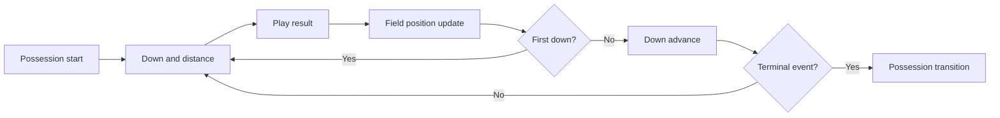

# SmartSim 2.0 Phase 3 State Engine Design

## Status

Design only. No code is modified in this phase.

References:

- [smartsim_2_phase1_implementation_report.md](smartsim_2_phase1_implementation_report.md)
- [smartsim_2_phase2_implementation_report.md](smartsim_2_phase2_implementation_report.md)
- [smartsim_2_phase2_calibration_plan.md](smartsim_2_phase2_calibration_plan.md)

## Phase 3 Objective

Replace outcome-driven drives with state-driven drives so SmartSim evolves into a true possession-by-possession football simulation engine.

Phase 1 proved the kernel can simulate a game loop.
Phase 2 gave that loop calibrated priors.
Phase 3 makes the loop genuinely football-like by modeling down, distance, field position, clock, red-zone compression, and possession transitions as explicit state.

## What Makes The Simulator Genuinely Football-Like?

The simulator becomes genuinely football-like when it stops choosing terminal drive outcomes directly and instead simulates the actual football state that creates those outcomes.

That requires:

1. The drive must advance through down and distance.
2. Field position must move play by play.
3. Clock must be consumed by each play and each stoppage.
4. First downs must reset the chain.
5. Sacks, penalties, explosive gains, turnovers, punts, field goals, and touchdowns must emerge from the same state engine.
6. Red-zone logic must compress the scoring distribution instead of using a single global score threshold.
7. Possession changes must be driven by football events, not by a generic terminal outcome selector.

## Phase 2 Heuristics That Must Be Eliminated

Phase 2 heuristics are useful calibration scaffolding, but they are no longer the end-state.

The following heuristics should be eliminated as drive-level shortcuts:

- direct one-step terminal outcome selection from a weighted drive-outcome bucket
- coarse field-position jump logic after touchdown, field goal, punt, turnover, or turnover on downs
- single-step drive termination that does not pass through down/distance progression
- clock burn as a direct prior-only estimate without play or stoppage logic
- red-zone handling as a simple outcome weight adjustment instead of a real compressed state
- possession changes that happen without a football event path

These heuristics should be replaced by explicit state transitions.

## State Engine Layers

Phase 3 should introduce one real football state engine with four nested pieces:

1. down-and-distance state model
2. field-position state model
3. red-zone state model
4. clock-management state model

Those models should be combined into a single possession state machine.

## 1. Down-And-Distance State Model

### Purpose

Represent the current chain state for the offense.

### Required fields

- `down`
- `distance`
- `yards_to_goal`
- `to_go`
- `series_id`
- `play_index`

### Derived states

- first down
- second and short
- second and long
- third and short
- third and long
- fourth-down decision state
- goal-to-go state

### Rules

- First downs reset `down` to 1 and `distance` to 10 unless the ball is already in goal-to-go territory.
- Short gains reduce `distance` and advance the chain.
- Failed plays advance `down`.
- Fourth down creates a terminal decision state: punt, field goal, attempt conversion, or turnover on downs.
- Goal-to-go should reduce the chain length and increase scoring probability.

### Football meaning

Down and distance are the core state variables that determine whether a drive is sustainable or collapsing.

## 2. Field-Position State Model

### Purpose

Represent where the ball is on the field and how valuable the next snap is.

### Required fields

- `yardline`
- `yardline_side`
- `yards_to_goal`
- `start_spot`
- `current_spot`
- `drive_start_spot`
- `drive_end_spot`

### Recommended representation

Use a normalized field-position model that can be replayed deterministically:

- absolute field location from 1 to 99
- offense-relative side indicator
- distance from scoring territory
- drive-start anchor for field-position gain calculations

### Rules

- positive gains move the offense toward the opponent end zone
- negative gains move the offense away from the opponent end zone
- touchdowns end the drive and reset the next possession start spot
- punts and turnovers must emit a new field position for the next offense
- penalties can move field position forward or backward before the next snap

### Football meaning

Field position must be a live state, not a label attached after the fact.

## 3. Red-Zone State Model

### Purpose

Compress the scoring environment when the offense enters the scoring area.

### Required fields

- `red_zone`
- `goal_to_go`
- `red_zone_entry_spot`
- `red_zone_play_count`

### Thresholds

Recommended phase-3 thresholds:

- red zone: inside the opponent 20
- goal-to-go: inside the opponent 10
- compressed goal-to-go: inside the opponent 5

### Rules

- red-zone entry should increase touchdown probability and field-goal probability
- red-zone entry should lower punt probability
- turnover risk should remain present but shaped by pressure and field compression
- goal-to-go should remove ordinary first-down logic and use goal-line logic

### Football meaning

The red zone is where generic field-position logic stops being enough and scoring compression takes over.

## 4. Clock-Management State Model

### Purpose

Track how the game clock and play clock evolve during a drive and across quarters.

### Required fields

- `game_clock_seconds`
- `play_clock_seconds`
- `quarter`
- `half`
- `timeouts_home`
- `timeouts_away`
- `possession_time_remaining`
- `two_minute_state`
- `hurry_up_state`

### Rules

- every play consumes game clock
- incompletions, out-of-bounds plays, scores, and punts can stop or reduce clock consumption
- hurry-up and trailing states should reduce play-clock usage
- leading teams should be able to burn more clock in later quarters
- timeout usage should modify clock consumption and end-of-half behavior
- end-of-quarter handling should occur because the clock expires, not because the simulator forced a quarter boundary

### Football meaning

Clock management is the difference between a score-projection model and a real simulation engine.

## Possession Transition Rules

Possession transitions should be driven by football events:

### First down

- chain resets
- offense keeps the ball
- field position advances
- down resets to 1

### Explosive gain

- field position jumps materially
- down may reset if the chain is converted
- red-zone entry may occur

### Sack or tackle-for-loss

- down advances
- distance increases or remains long
- turnover risk rises on future snaps

### Turnover

- possession flips immediately
- next offense starts from the turnover spot or a return-adjusted spot
- game script may shift because of score differential

### Punt

- possession flips immediately
- next offense inherits the punt result field position
- field-position advantage or disadvantage becomes part of the next drive state

### Field goal

- three points are added
- possession flips immediately
- next offense starts from a kickoff-derived spot or simplified next-possession spot in Phase 3

### Touchdown

- seven points are added
- possession flips immediately
- next offense starts from a kickoff-derived spot or simplified next-possession spot in Phase 3

### End of quarter / half

- drive state must persist or terminate according to the game clock
- the possession should only stop because time ran out, not because the model chose a quarter boundary

## Drive Progression Design

Drive progression should become a sequence of football plays rather than a one-shot outcome selection.

### Drive loop steps

1. Initialize possession state.
2. Resolve down-and-distance and field-position context.
3. Sample a play result.
4. Update field position.
5. Update down and distance.
6. Update clock.
7. Determine whether the drive continues or ends.
8. Repeat until a terminal football event occurs.

### Drive events that must exist

- first down conversion
- explosive gain
- sack / negative play
- incomplete-like null gain or stalled gain
- turnover
- punt decision
- field goal decision
- touchdown
- turnover on downs

### Drive termination logic

A drive should terminate only when one of these is true:

- touchdown occurs
- field goal is made or missed and the possession changes
- punt occurs
- turnover occurs
- turnover on downs occurs
- the quarter or half ends and clock expires

## State Flow

## How Field Position Should Evolve

Field position should evolve in four ways:

1. play gain or loss changes the spot on the field
2. first down advances the chain and changes remaining distance
3. turnovers and punts flip possession and establish the next starting spot
4. scoring resets the next possession to a post-score starting spot

The evolution should be continuous and replayable.

### Required outputs

- current field spot
- drive-start spot
- drive-end spot
- net field position gain
- red-zone entry flag
- next-possession spot

## How Clock State Should Evolve

Clock should evolve as a function of play type and game script.

### Clock inputs

- play result
- timeout state
- score differential
- quarter
- hurry-up state
- trailing / leading state

### Clock outputs

- play clock consumed
- game clock consumed
- end-of-quarter state
- end-of-half state

### Clock rules

- normal plays should consume the most clock
- incomplete or stoppage plays should consume less
- explosive plays may consume less due to quicker development
- trailing teams should preserve time more aggressively
- leading teams should drain more time late

## When Can Quarter Projections Become Reliable?

Quarter projections become reliable when the simulator can correctly accumulate play-level state into quarter-level state under all of these conditions:

- drive lengths are state-driven rather than heuristic
- field position changes are realistic across multiple plays
- red-zone drives are modeled distinctly from open-field drives
- clock consumption is derived from play behavior
- possession changes occur for football reasons, not direct terminal selection
- historical quarter totals can be replayed with acceptable error

In practical terms, quarter projections become reliable after the state engine can reproduce drive duration and scoring distribution over a sufficiently large historical validation set.

## What Phase 3 Should Remove From The Current Kernel

Phase 3 should remove reliance on:

- direct terminal outcome sampling as the main drive engine
- coarse post-outcome field resets
- generic prior-to-outcome translation that bypasses football state
- non-stateful clock burn

Those behaviors can remain as fallback safety paths, but they should not be the primary drive mechanism.

## What Should Remain From Phase 2

Phase 3 should keep the calibrated priors from Phase 2:

- offense priors
- defense priors
- pace priors
- returning production priors
- coach continuity priors
- transfer volatility priors
- market priors

The difference is that those priors will now inform state transitions instead of directly selecting terminal outcomes.

## Suggested Phase 3 Kernel Shape

The state engine should likely introduce a new internal module family:

- `state_model.py`
- `drive_state.py`
- `field_position.py`
- `clock_state.py`
- `red_zone_state.py`
- `possession_transition.py`
- `drive_progression.py`

This can remain inside the existing SmartSim 2.0 package so the projection engine and public football surfaces stay untouched.

## Final Answer

Phase 3 makes SmartSim football-like by replacing one-step drive outcome selection with explicit football state.

The simulator should now think in terms of:

- down and distance
- field position
- red-zone compression
- clock consumption
- possession transition
- drive progression

Once those are explicit, quarter projections stop being a rough byproduct and become a reliable accumulation of real football state.