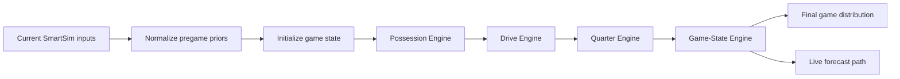

# SmartSim 2.0 Possession Simulation Architecture

## Status

Design only. This document defines the next-generation football simulation architecture without changing any football model calculations yet.

## Scope

This architecture applies to NCAAF SmartSim and is intentionally framed as the shortest path from the current score-projection system to a true possession-by-possession simulator.

Current runtime outputs already include:

- projected final score
- win probability
- projected spread
- projected total
- team context
- matchup context

Those outputs are useful, but they do not yet prove that the engine is simulating possessions, drives, quarters, and live game state as first-class events.

## Executive Answer

The current engine is fundamentally a projection engine.

It can be extended, but only if the extension introduces a new stateful simulation kernel rather than trying to force possession logic into the existing mean-outcome contract.

The best path is to refactor the current engine boundary, preserve the existing public contract, and add a new possession simulator behind it.

## Current Reference Surface

Relevant existing references:

- [docs/intelligence_ask_projection_architecture.md](docs/intelligence_ask_projection_architecture.md)
- [docs/ai_context/simulation_adapter_design.md](docs/ai_context/simulation_adapter_design.md)
- [docs/ai_context/simulation_gaps.md](docs/ai_context/simulation_gaps.md)
- [docs/ai_context/simulation_engine_map.md](docs/ai_context/simulation_engine_map.md)
- [docs/ai_context/data_flow_system.md](docs/ai_context/data_flow_system.md)
- [docs/ai_context/phase3_sports_adapter_standardization_blueprint.md](docs/ai_context/phase3_sports_adapter_standardization_blueprint.md)

Current NCAAF builder surface already carries the following reusable context lanes:

- returning production
- coach continuity
- transfer activity
- roster experience / roster base
- conference / subdivision context
- market-derived scoreboard projection fields
- SmartSim reasons and matchup context

The current shared simulation adapter also already normalizes:

- game identity
- team projections
- player projections when present
- market data
- live state
- evaluation context
- display-only enrichment

## Current SmartSim Input Audit

### 1. Pace

Current state:

- Not a first-class possession input in the current NCAAF SmartSim contract.
- It may be implied indirectly through projected totals, spread shape, or source-card context.

Assessment:

- Partial support only.
- Pace is not yet a simulation-state variable.

What should exist:

- expected plays per possession
- expected possessions per game
- pace variance by matchup and game state

### 2. Offensive Metrics

Current state:

- The current projection stack clearly uses score and win-probability outputs.
- Team context can explain offense-adjacent strength through returning production, roster experience, transfer activity, and conference/subdivision context.

Assessment:

- Partially supported.
- Offensive quality exists as context and projection pressure, but not as a drive-outcome model.

What should exist:

- explosiveness
- success rate
- efficiency by down
- red-zone efficiency
- turnover avoidance
- sack avoidance / pressure tolerance

### 3. Defensive Metrics

Current state:

- Defensive metrics are not visible as a dedicated first-class simulation state in the current NCAAF SmartSim contract.
- If they exist upstream, they are not yet exposed as possession-relevant state.

Assessment:

- Missing as a true simulation input layer.

What should exist:

- opponent drive success suppression
- explosive-play suppression
- turnover creation
- red-zone hold rate
- pressure generation / havoc rate

### 4. Roster Factors

Current state:

- Strongly supported as context.
- The builder already carries roster and returning-production signals in the NCAAF card contract.

Assessment:

- Supported as a contextual modifier.
- Not yet decomposed into possession-level effects.

What should exist:

- lineup stability
- starter continuity
- skill-position depth
- injury-adjusted availability
- rotation depth for fatigue and fourth-quarter effects

### 5. Transfer Factors

Current state:

- Supported as a context signal.
- Transfer activity is already part of the NCAAF SmartSim reasons layer.

Assessment:

- Supported as a roster-quality modifier.
- Not yet tied to drive or possession state transitions.

What should exist:

- portal-in / portal-out adjustment
- continuity volatility adjustment
- early-season uncertainty penalty or boost

### 6. Coach Continuity

Current state:

- Supported directly in the current NCAAF context contract.

Assessment:

- Supported.
- Still used as a projection/context factor rather than a simulation-state factor.

What should exist:

- tempo stability
- situational aggressiveness
- fourth-down tendency
- two-minute strategy

### 7. Market Factors

Current state:

- Supported through projected score, spread, total, and win probability.
- Market context appears in the shared recommendation and odds layers.

Assessment:

- Strongly supported as calibration input.
- Not yet used to shape simulated state transitions directly.

What should exist:

- spread-derived priors
- total-derived pace priors
- line movement confidence
- implied-volatility shaping

## What Already Supports Simulation Behavior

### Possessions

Already helpful:

- projected total
- projected spread
- win probability
- pace-like team context
- game context that can seed expected scoring volume

Still missing:

- explicit possessions per game
- possession sequence state
- starting field position

### Drive Success

Already helpful:

- offensive context
- coach continuity
- roster experience
- transfer balance
- market shape

Still missing:

- drive start state
- drive length distribution
- drive success / stall / turnover outcomes

### Scoring Probability

Already helpful:

- projected final score
- projected total
- win probability
- matchup context

Still missing:

- scoring probability by drive state
- scoring probability by field position
- scoring probability by down and distance

### Turnover Probability

Already helpful:

- market and context signals can imply volatility

Still missing:

- explicit turnover model
- interception / fumble / turnover-on-downs branches
- turnover return field-position effects

### Explosive-Play Probability

Already helpful:

- offensive quality context
- market totals
- matchup context

Still missing:

- play-level or drive-level explosive-event model
- chunk-play frequency
- explosive-play field-position and clock effects

## Missing State Variables

The current engine is missing the state variables required for a true possession simulator:

- field position
- down and distance abstractions
- drive state
- game clock
- quarter state
- possession transitions
- timeout state
- red-zone state
- end-of-half state
- end-of-game state
- garbage-time state
- lead / trail game-script state

## SmartSim 2.0 Architecture

### Layer 1: SmartSim Possession Engine

Purpose:

- simulate one possession at a time
- decide possession outcome
- advance field position and clock

Inputs:

- offensive efficiency
- defensive resistance
- pace prior
- field position prior
- down / distance state
- turnover priors
- explosive-play priors
- market priors
- roster / coach / transfer modifiers

Outputs:

- possession result
- yards gained or lost
- drive continuation flag
- scoring event flag
- turnover flag
- next possession start state

Minimal output states:

- punt
- turnover
- field goal attempt
- field goal made
- field goal missed
- touchdown
- turnover on downs
- drive stall

### Layer 2: SmartSim Drive Engine

Purpose:

- convert a possession state into a sequence of event-level outcomes
- model a drive as a chain of state transitions

Inputs:

- starting field position
- down / distance
- offensive and defensive drive quality
- pace and clock pressure
- explosive and turnover priors

Outputs:

- drive length
- play count estimate
- expected yardage
- scoring outcome
- field-position exit state

Recommended internal event buckets:

- short gain
- standard gain
- explosive gain
- negative play
- drive-ending turnover
- drive-ending penalty chain
- scoring finish

### Layer 3: SmartSim Quarter Engine

Purpose:

- aggregate possessions into quarter-level scoring and state movement
- capture quarter pace shifts and end-of-quarter effects

Inputs:

- possession stream
- drive outcomes
- quarter clock state
- timeout usage
- score differential

Outputs:

- quarter scoring distribution
- quarter possession count
- quarter pace variance
- quarter lead / trail state
- half-time state snapshot

### Layer 4: SmartSim Game-State Engine

Purpose:

- maintain the full game simulation state across all quarters
- decide possession order, clock roll, score state, and game termination

Inputs:

- initial pregame priors
- possession engine
- drive engine
- quarter engine
- live or pregame modifiers

Outputs:

- full game distribution
- final score distribution
- win probability distribution
- spread distribution
- total distribution
- live-state forecast path

## Proposed Simulation Flow

## Current SmartSim vs True Possession Simulator

| Dimension | Current SmartSim | True Possession Simulator |
| --- | --- | --- |
| Primary object | Team strength / projected score | Possession state |
| Core unit | Game-level mean outcome | Drive-level and play-sequence outcomes |
| Time handling | Implicit through projection math | Explicit clock and quarter state |
| Field position | Not first-class | First-class |
| Down / distance | Not first-class | First-class |
| Possession changes | Implicit | Explicit |
| Turnovers | Embedded in output variance | Explicit branch |
| Explosive plays | Embedded in scoring variance | Explicit branch |
| Quarter effects | Derived after projection | Simulated during runtime |
| Live game support | Limited / indirect | Native |
| Output shape | Final score, spread, total, win probability | Distribution over drives, quarters, and final outcomes |

## What Can Be Reused

The following can be reused without changing football model calculations immediately:

- current NCAAF source-selection and weekly summary loading
- team context and matchup context generation
- returning production, coach continuity, transfer, and roster snapshots
- market priors and odds integration
- evaluation and calibration scaffolding
- current board, game detail, live-lens, and picks contracts
- shared simulation adapter and board contract wrappers
- existing output presentation and ranking surfaces

## What Must Be Rebuilt

The following must be rebuilt or introduced as new simulation primitives:

- possession state model
- drive state model
- quarter state model
- full game-state transition loop
- explicit field-position model
- down / distance abstraction
- turnover branch logic
- explosive-play branch logic
- clock consumption logic
- live-state update logic for in-game forecasting

## Minimum Viable Possession Simulator

The smallest useful possession simulator should do the following:

1. Start each drive from a field-position state.
2. Sample a drive outcome from offensive, defensive, and market priors.
3. Produce one of a small set of terminal results.
4. Advance the clock and score.
5. Hand the next possession to the opponent.
6. Repeat until the game ends.

Minimum viable state:

- quarter
- clock
- possession team
- field position
- score differential
- down / distance
- drive count

Minimum viable outcome set:

- touchdown
- field goal
- punt
- turnover
- turnover on downs
- drive stall

Minimum viable outputs:

- final score distribution
- possession count distribution
- quarter scoring distribution
- win probability
- spread distribution
- total distribution

## Phase Roadmap

### Phase 1: Possession Model

Goal:

- introduce possession-level state and outcome sampling without changing the visible board contract.

Deliverables:

- possession state schema
- field-position inputs
- down / distance abstraction
- possession outcome distribution
- state transition API

Validation:

- possession counts are finite and replayable
- outputs still match the current projection contract shape

### Phase 2: Drive Model

Goal:

- convert possession outcomes into multi-event drives.

Deliverables:

- drive event taxonomy
- drive length model
- turnover and explosive-play branches
- drive-end scoring outcomes

Validation:

- drive outcomes aggregate cleanly into possession totals
- scoring distribution remains stable against the projection baseline

### Phase 3: Quarter Model

Goal:

- simulate quarter-by-quarter scoring and clock effects.

Deliverables:

- quarter state transitions
- quarter scoring distributions
- halftime and end-of-quarter snapshots

Validation:

- quarter totals sum to game totals
- quarter state is reproducible from stored priors

### Phase 4: Live Game-State Simulation

Goal:

- allow live-state updates to advance the simulator during games.

Deliverables:

- live possession update path
- in-game clock and score transitions
- live forecast recalculation

Validation:

- live game state updates are monotonic and replayable
- in-game forecasts remain contract-compatible with the existing board

### Phase 5: Full SmartSim Runtime

Goal:

- unify pregame and live simulation into one runtime service.

Deliverables:

- one runtime engine
- persisted simulation state
- forecast refresh and replay support
- board, live-lens, and intelligence contract integration

Validation:

- final score, quarter state, drive state, and live forecast all reconcile
- the engine can be replayed from stored artifacts and current priors

## Shortest Path

The shortest path is not a greenfield rewrite of the board or intelligence layer.

The shortest path is:

1. Preserve the current projection-facing contract.
2. Introduce a new possession-state kernel behind the existing SmartSim runtime.
3. Reuse current team, roster, coach, transfer, and market priors as simulation priors.
4. Add explicit state variables for field position, clock, quarter, and possession.
5. Graduate from possession outputs to drive outputs, then quarter outputs, then live state.

## Final Verdict

Build new simulator, but through a refactor of the current engine boundary.

In practical terms, that means:

- extend the current contract and UI surfaces
- rebuild the simulation core as a stateful possession engine
- keep the existing projection outputs as compatibility outputs until the new simulator is fully validated

That is the shortest path from the current score-projection architecture to a true possession-by-possession football simulation engine.